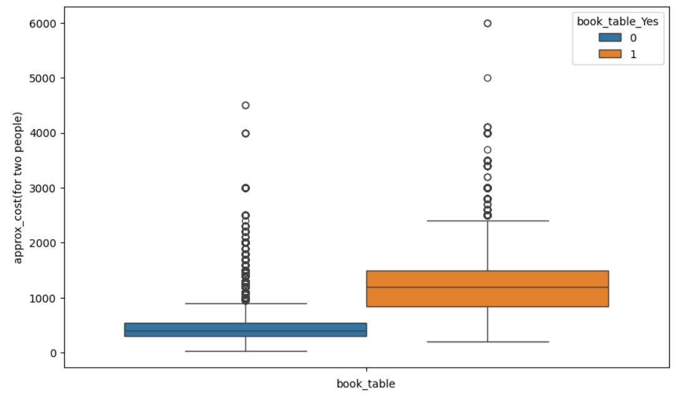
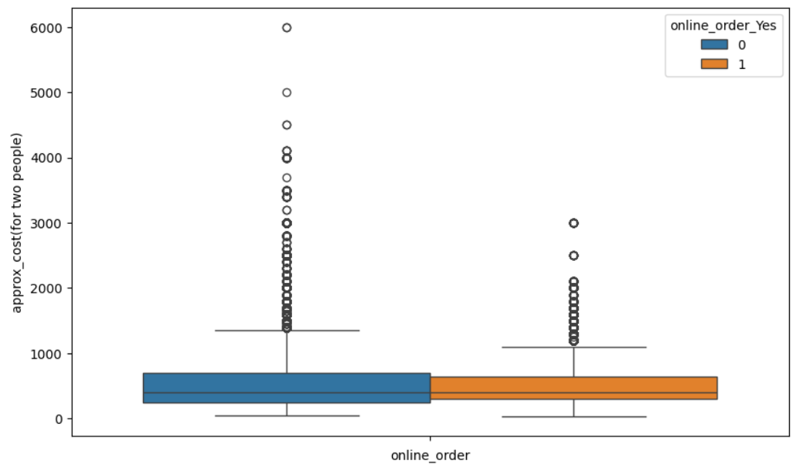
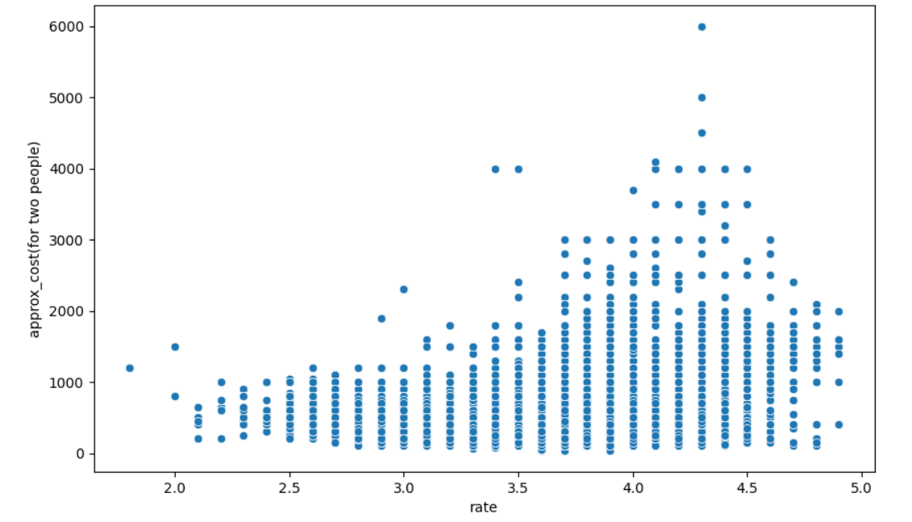
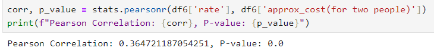
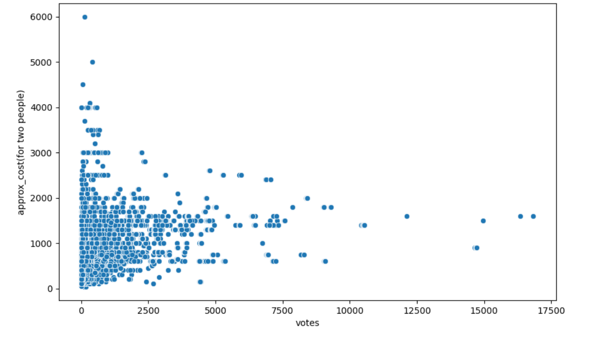
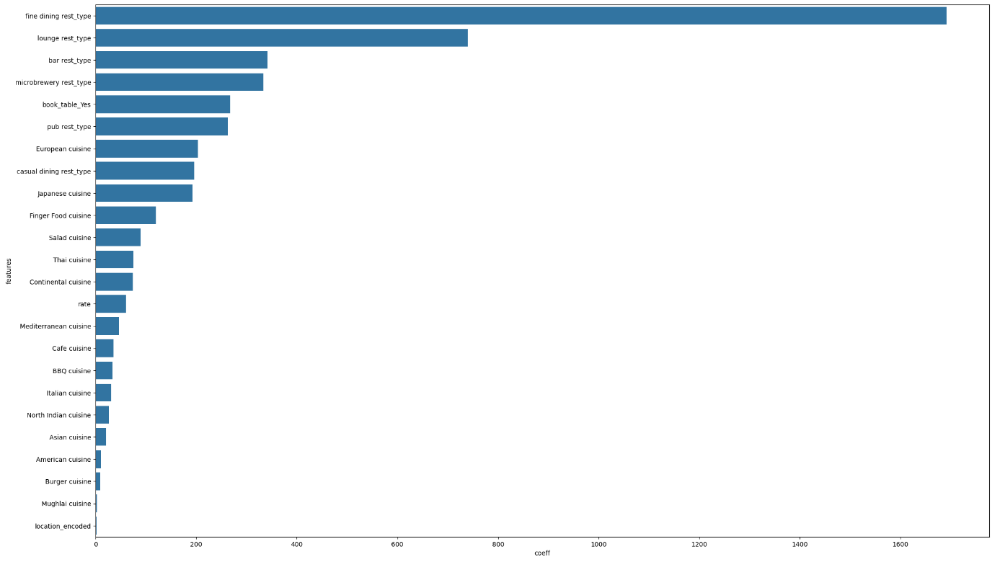
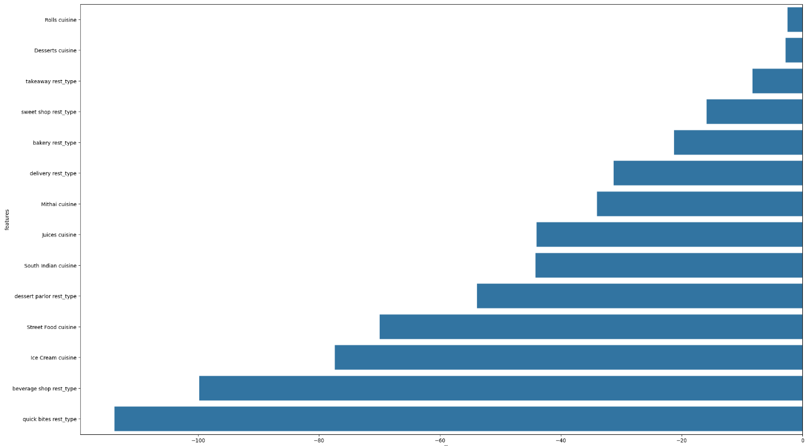

# Zomato Data Analysis

In this project we try to solve to 2 major real world problems with zomato dataset.

## Problems

1. The newly started companies are not able to decide the cost that would happen per two people for once. So the Zomato company has a good analyst team who can predict the cost per two customers for one time so that the newly started restaurants and upcoming 
restaurants will be well prepared how the restaurant should invest in improving the ambiance and all other stuff to attract the customers. Assume you are the analyst team that Zomato has organized to help new and upcoming restaurants by letting them know the various reasons that customers look for and build a model which able to predict the cost for two people. 

2. Now Zomato has been observing the orders happening online and 
offline, Due to offline orders, Zomato is not able to attract customers with diverse items and 
offers, and the user subscription also getting low. so it has decided to give you the project 
on the same. Now the problem statement is that Zomato wants to know whether the 
customer would order the orders online or offline so that Zomato can take further 
strategies to improve the online order. 

## Solution for problem 1

After performing data cleaning, feature engineering, we performed data analysis, in that we got some findings.

**Table booking Vs Approximate cost**

As you can see from this plot the Cost in higher if a Customer is booking his table. So it is a important feature.

**Online order Vs Approximate cost**

In this plot we can see that based on Online order the price is not varying very much, you can see that 25th to 75th percentile cost of the two classes are almost same. So we can drop online order column.

**Rating Vs Approximate cost**

We can able to see some corrlation between the rating and the approx cost, as the rating increases the cost is also increasing for some restorents. So we can keep this feature.

It is also proved by this statistical test, where we got p-value = 0 which is less than 0.05, which tells us, by assuming there is no reation between this two columns getting this corrlation value (0.36) is 0 probability.

So we can say there is a realtion between these two columns.

**Votes Vs Approximate cost**

This plot tell us reationship between votes and cost, here we can see that restorents with 0 votes have high cost.

Even though the relationship is clear, we dropping this column because it may miss lead our model for our problem statement.

## Model Building 

- After the analysis, we built our base model (OLS), and we droped the features which as p-value grater than 0.05, which significantly reduced the multicollinearity in our model.
- After we built another model with this features dropped.
- After we found the features which used to increase the cost and which features are reducing the cost and which features are not affecting the cost that much using L1 regulariazation (lasso).

**Features Increases Cost**

**Features Decreases Cost**

And all other features are not affecting the cost that much.

**To view the notebook** -> [Notebook](notebooks/zomato_data_analysis.ipynb)

**To use the model** -> [Streamlit app](https://zomatodataanalysis-by-giridaran.streamlit.app/)

